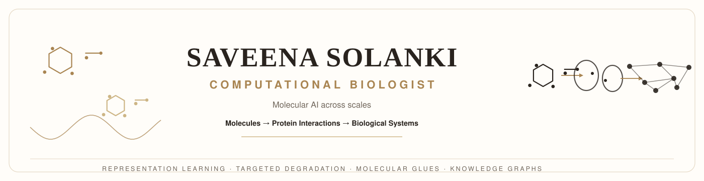

  

  
  
  
  
  

---

## 🧬 About

> **Computational biologist building AI beyond observed biological space** — across unseen
> molecules, proteins, interactions, and cellular states.

I work at the intersection of **machine learning, cheminformatics, and biomedical knowledge
graphs**, turning messy biological data into structured, reproducible, ML-ready pipelines.
Every project on this profile is small by design, composable by philosophy, and tested by default.

**IIIT Delhi** · Computational Biology · Open Science

---

## 🔬 Research Pillars

| | Focus | Tooling |
|---|---|---|
| 🧪 **Molecular representation** | SMILES cleaning, canonicalization, scaffold-aware splitting, chemical-space analysis | RDKit, scikit-learn |
| 🧫 **Bioactivity & assay data** | Unit standardization, pActivity conversion, data-quality flagging | pandas, NumPy |
| 🕸️ **Biomedical knowledge graphs** | Relation-sign standardization, structural auditing, identifier harmonization | pandas, Typer |
| 🤖 **ML engineering for biology** | Leakage-aware splits, featurizer baselines, reproducible CLI pipelines | scikit-learn, pytest, ruff |

---

## 🛠️ CompBio Toolkit Suite

A curated suite of lightweight, open-source utilities for computational biology and drug-discovery
data engineering — each tool ships with a **CLI**, a **Python API**, and a **pytest** suite.

| Tool | CLI | Purpose |
|---|---|---|
| [**smiles-cleankit**](https://github.com/SaveenaSolanki/smiles-cleankit) | `smiles-clean` | Clean, canonicalize, desalt & validate SMILES; InChIKey generation |
| [**assaytablecleaner**](https://github.com/SaveenaSolanki/assaytablecleaner) | `assay-clean` | Standardize assay units → molar, compute pActivity, flag quality issues |
| [**scaffoldsplitlab**](https://github.com/SaveenaSolanki/scaffoldsplitlab) | `scaffold-split` | Leakage-aware scaffold / random / hash splits for molecular ML |
| [**biokg-signmapper**](https://github.com/SaveenaSolanki/biokg-signmapper) | `biokg-sign` | Map KG relations → controlled signs (activation, inhibition, …) |
| [**kg-stats-audit**](https://github.com/SaveenaSolanki/kg-stats-audit) | `kg-audit` | Node/edge statistics, degree distributions, isolated-node detection |
| [**molidmapper**](https://github.com/SaveenaSolanki/molidmapper) | `molid-map` | Detect & merge PubChem / ChEMBL / DrugBank / UniProt identifiers |

**Also building:**
- 🎨 [**SciSVG**](https://github.com/SaveenaSolanki/SciSVG) — an open library of editable scientific vector graphics for figures, presentations, and publications (30+ assets, CC BY 4.0)
- 📄 [**Academic profile**](https://saveenasolanki.github.io/) — personal site & portfolio

---

## 🧰 Tech Stack

  
  
  
  
  
  
  
  
  
  

---

## 📊 GitHub Analytics

  
  
   
  
    
  
    
  

---

## 📬 Connect

  
  
  

  <i>"Open tools, reproducible science, small composable pieces."</i>

