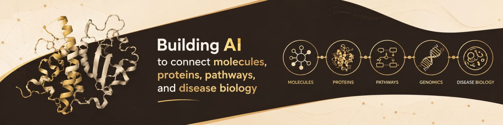
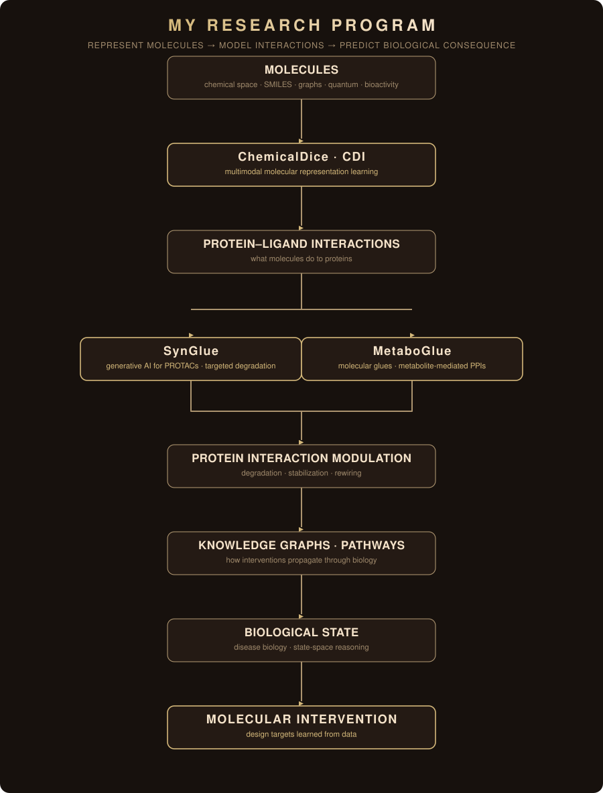
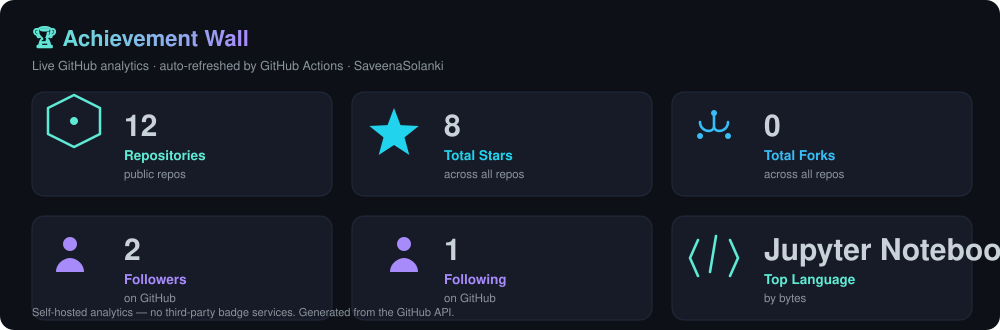

  

  
  
  
  

---

## SAVEENA SOLANKI

### Computational Biology × Molecular AI

**Building AI from molecular representation to protein interactions and biological systems.**

*Representation learning · molecular interactions · targeted degradation · molecular glues · biomedical knowledge graphs*

---

## My Research

One continuous arc — from single molecules to the biological systems they reshape:

  

---

## Selected Research

| System | What it is | Status |
|---|---|---|
| [**ChemicalDice · CDI**](https://github.com/the-ahuja-lab/ChemicalDice) | Multimodal molecular representation learning — fuses bioactivity, language, graph, physicochemical, and image-based views of a molecule into one latent embedding, distilled into a SMILES-based model for chemical-space generalization | [Code](https://github.com/the-ahuja-lab/ChemicalDice) · [Docs](https://the-ahuja-lab.github.io/ChemicalDice/) · [Colab](https://colab.research.google.com/drive/1I6vQ_7SlhagbnXVlg4btWoYal_NcCElt?usp=sharing) |
| [**SynGlue**](https://github.com/the-ahuja-lab/SynGlue) | Generative AI for targeted protein degradation — generates, analyzes, and optimizes PROTACs; predicts degradation potency (DC₅₀, Dmax) and guides linker selection | [Code](https://github.com/the-ahuja-lab/SynGlue) · [PyPI](https://pypi.org/project/synglue/) · [Colab](https://colab.research.google.com/drive/1k3UyoqYU_zw6_GbdeaARe155dCi_JO6Q?usp=sharing) |

**Mechanism-aware molecular ML** — *first-author projects*, connecting chemical representations with interpretable biological mechanisms:

| Project | What it is | Links |
|---|---|---|
| [**EvOlf**](https://github.com/the-ahuja-lab/EvOlf) | Evolutionary-guided deep learning for mammalian GPCRome agonist prediction — ligand–GPCR interactions across 20+ species, odorant & non-odorant GPCRs, deorphanization | [Code](https://github.com/the-ahuja-lab/EvOlf) · [Web server](https://evolf.ahujalab.iiitd.edu.in/) · [Pipeline](https://github.com/the-ahuja-lab/evolf-pipeline) |
| [**evolf-pipeline**](https://github.com/the-ahuja-lab/evolf-pipeline) | Nextflow pipeline for large-scale ligand–GPCR interaction screens — featurization, protein embeddings, deep-learning inference on HPC/cloud | [Code](https://github.com/the-ahuja-lab/evolf-pipeline) |
| [**Trojan-Horses**](https://github.com/the-ahuja-lab/Trojan-Horses) | Mechanism-aware deep learning for ROS modulator & antioxidant activity prediction with mechanistic interpretability | [Code](https://github.com/the-ahuja-lab/Trojan-Horses) |
| [**Gcoupler**](https://github.com/the-ahuja-lab/Gcoupler) | AI-driven structure-based de novo ligand design — graph neural networks, statistical validation, bioactivity prioritization; GPCR–Gα allosteric modulation | [Code](https://github.com/the-ahuja-lab/Gcoupler) · [eLife preprint](https://elifesciences.org/reviewed-preprints/106397) |
| [**Inertrope**](https://github.com/the-ahuja-lab/Inertrope) | Thermodynamic fingerprints → liquid-biopsy diagnostics — multiclass classification of ITC/spectroscopic data (Healthy · Benign · Cancer) | [Code](https://github.com/the-ahuja-lab/Inertrope) |
| **MetaboGlue** | Metabolite-mediated protein-interaction stabilization & inhibition — molecular glues at the interface of metabolism and proteostasis | *in preparation* |
| **SynMol** | *in preparation* | *in preparation* |

---

## Research Infrastructure

The scientific systems above depend on reliable molecular and biological data. I therefore
maintain a modular computational-biology toolkit covering molecular standardization, assay
harmonization, identifier resolution, molecular splitting, and knowledge-graph quality control.

[**Prepare**](https://github.com/SaveenaSolanki/smiles-cleankit) → [**Harmonize**](https://github.com/SaveenaSolanki/assaytablecleaner) → [**Map**](https://github.com/SaveenaSolanki/molidmapper) → [**Split**](https://github.com/SaveenaSolanki/scaffoldsplitlab) → [**Structure**](https://github.com/SaveenaSolanki/biokg-signmapper) → [**Audit**](https://github.com/SaveenaSolanki/kg-stats-audit)

| Stage | Tool | CLI |
|---|---|---|
| Prepare | [smiles-cleankit](https://github.com/SaveenaSolanki/smiles-cleankit) | `smiles-clean` |
| Harmonize | [assaytablecleaner](https://github.com/SaveenaSolanki/assaytablecleaner) | `assay-clean` |
| Map | [molidmapper](https://github.com/SaveenaSolanki/molidmapper) | `molid-map` |
| Split | [scaffoldsplitlab](https://github.com/SaveenaSolanki/scaffoldsplitlab) | `scaffold-split` |
| Structure | [biokg-signmapper](https://github.com/SaveenaSolanki/biokg-signmapper) | `biokg-sign` |
| Audit | [kg-stats-audit](https://github.com/SaveenaSolanki/kg-stats-audit) | `kg-audit` |

Six small tools, one pipeline — each CLI-first, tested with `pytest`, linted with `ruff`,
documented with toy examples so every result is reproducible. Suite overview:
[**compbio-toolkit-suite**](https://github.com/SaveenaSolanki/compbio-toolkit-suite).

---

## Open Science & Collaboration

Science should be reproducible — including its figures. I maintain
[**SciSVG**](https://github.com/SaveenaSolanki/SciSVG), an open library of editable
scientific vector graphics (30+ assets, CC BY 4.0) for figures, presentations, and
publications, and an [academic profile](https://saveenasolanki.github.io/) with my research
and portfolio.

I am open to collaborations on **molecular representation learning, targeted degradation
(PROTACs & molecular glues), and biomedical knowledge-graph modeling** — and to building
the data infrastructure those projects need.

  
  
  

---

  
   <i>From raw molecules to learned models — open tools, reproducible science, small composable pieces.</i> 
  Achievement wall generated from the GitHub API by <a href=".github/workflows/analytics.yml">GitHub Actions</a>.

